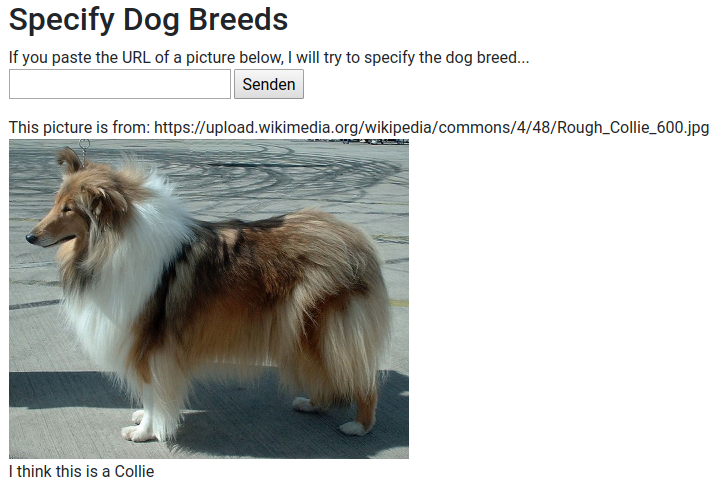
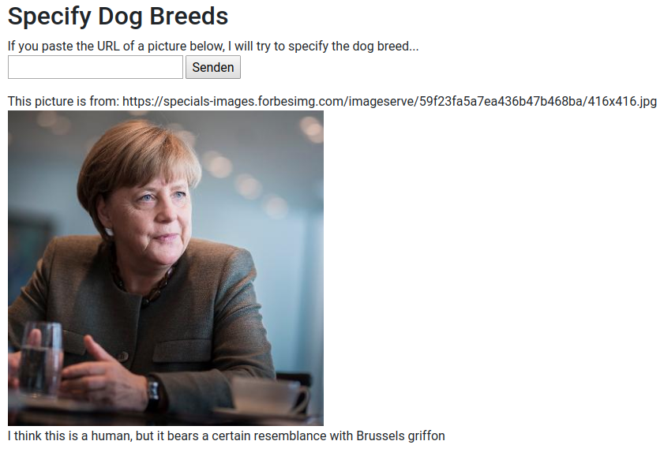

# Dog Breed Specifier
This project is my capstone project for the [Udacity](www.udacity.com) Data-Science NanoDegree. The goal is to develop an algorithm which is able to predict the dog breed present in a picture and deploy it into a web-app. In addition the algorithm should detect humans and return a dog breed which resembles them most.

## Project Overview
The Jupyter notebook dog_app.ipynb is based on a notebook provided by Udacity. It walked me (and will also walk you) through the process of data exploration and the development of several neural networks for predicting the dog breed (make sure to follow the installation steps before running the notebook). After executing all cells in the notebook, you can start the web-app by running "python dogbreeds.py". The app is then ready to be opened in a browser at "127.0.0.1:3001".

>In the app you can drop a URL to the picture you would like to analyse:
 

>This also works for humans:
 

## Analysis and Methodology
This project uses a [set of pictures with human faces](https://s3-us-west-1.amazonaws.com/udacity-aind/dog-project/lfw.zip) as well as a [set of dog pictures](https://s3-us-west-1.amazonaws.com/udacity-aind/dog-project/dogImages.zip) labeled with the according breeds. Based on this training data several machine learning models are built.
* A pre-trainend Haar feature-based cascade classifier from OpenCV is used to detect human faces
* A pre-trained [ResNet-50 model](http://ethereon.github.io/netscope/#/gist/db945b393d40bfa26006) is used to detect images with dogs.

In the project three different models for the classification of dog breeds have been developed. The first model is a CNN (built from scratch) consisting of 4 consecutive convolutional layers, each followed by a MaxPooling layer. After flattening the output of the last MaxPooling Layer, a final Dense layer with softmax activation function determines the final output of the model. After training the model it achieves an accuracy of **7.3%** on the test set. This result is actually quite good, taking into account that there are 133 distinct labels (i.e. dog breeds)!

A huge improvement is achieved by the second model using transfer learning. This model uses a pre-trained VGG-16 model and just adds a GlobalAveragePooling layer and a final Dense layer. Making use of the pre-trained layers of the VGG-16 model, which already can detect useful patterns in the images, this model achieves an accuracy of **44.7%** on the test data.

The third model also uses transfer learning but instead of the VGG-16 model it is based on a pre-trained Resnet50 model. By adding a GlobalAveragePooling layer and a BatchNormalization layer (to avoid overfitting) before the final Dense layer, this model achieves an accuracy of **79.8%** on the test data!

In combination with the human face detector and the dog detector, this third model is utilized in the final image processing algorithm. This algorithm is then implemented in the web-app.

## Conclusion
The comparison of the three models clearly shows the huge benefits of transfer learning when it comes to image classification tasks. The pre-trained VGG-16 and Resnet-50 models boost the performance of the resulting models, because they have been trained on very large sets of training data. These large sets of training data allow them to develop efficient ways of recognizing useful patterns in the images.


## Installation Instructions

1. Clone the repository and navigate to the downloaded folder.
```	
git clone https://github.com/udacity/dog-project.git
cd dog-project
```

2. Download the [dog dataset](https://s3-us-west-1.amazonaws.com/udacity-aind/dog-project/dogImages.zip).  Unzip the folder and place it in the repo, at location `path/to/dog-project/dogImages`. 

3. Download the [human dataset](https://s3-us-west-1.amazonaws.com/udacity-aind/dog-project/lfw.zip).  Unzip the folder and place it in the repo, at location `path/to/dog-project/lfw`.  If you are using a Windows machine, you are encouraged to use [7zip](http://www.7-zip.org/) to extract the folder. 

4. Donwload the [VGG-16 bottleneck features](https://s3-us-west-1.amazonaws.com/udacity-aind/dog-project/DogVGG16Data.npz) for the dog dataset.  Place it in the repo, at location `path/to/dog-project/bottleneck_features`.

5. (Optional) __If you plan to install TensorFlow with GPU support on your local machine__, follow [the guide](https://www.tensorflow.org/install/) to install the necessary NVIDIA software on your system.  If you are using an EC2 GPU instance, you can skip this step.

6. (Optional) **If you are running the project on your local machine (and not using AWS)**, create (and activate) a new environment.

	- __Linux__ (to install with __GPU support__, change `requirements/dog-linux.yml` to `requirements/dog-linux-gpu.yml`): 
	```
	conda env create -f requirements/dog-linux.yml
	source activate dog-project
	```  
	- __Mac__ (to install with __GPU support__, change `requirements/dog-mac.yml` to `requirements/dog-mac-gpu.yml`): 
	```
	conda env create -f requirements/dog-mac.yml
	source activate dog-project
	```  
	**NOTE:** Some Mac users may need to install a different version of OpenCV
	```
	conda install --channel https://conda.anaconda.org/menpo opencv3
	```
	- __Windows__ (to install with __GPU support__, change `requirements/dog-windows.yml` to `requirements/dog-windows-gpu.yml`):  
	```
	conda env create -f requirements/dog-windows.yml
	activate dog-project
	```

7. (Optional) **If you are running the project on your local machine (and not using AWS)** and Step 6 throws errors, try this __alternative__ step to create your environment.

	- __Linux__ or __Mac__ (to install with __GPU support__, change `requirements/requirements.txt` to `requirements/requirements-gpu.txt`): 
	```
	conda create --name dog-project python=3.5
	source activate dog-project
	pip install -r requirements/requirements.txt
	```
	**NOTE:** Some Mac users may need to install a different version of OpenCV
	```
	conda install --channel https://conda.anaconda.org/menpo opencv3
	```
	- __Windows__ (to install with __GPU support__, change `requirements/requirements.txt` to `requirements/requirements-gpu.txt`):  
	```
	conda create --name dog-project python=3.5
	activate dog-project
	pip install -r requirements/requirements.txt
	```
	
8. (Optional) **If you are using AWS**, install Tensorflow.
```
sudo python3 -m pip install -r requirements/requirements-gpu.txt
```
	
9. Switch [Keras backend](https://keras.io/backend/) to TensorFlow.
	- __Linux__ or __Mac__: 
		```
		KERAS_BACKEND=tensorflow python -c "from keras import backend"
		```
	- __Windows__: 
		```
		set KERAS_BACKEND=tensorflow
		python -c "from keras import backend"
		```

10. (Optional) **If you are running the project on your local machine (and not using AWS)**, create an [IPython kernel](http://ipython.readthedocs.io/en/stable/install/kernel_install.html) for the `dog-project` environment. 
```
python -m ipykernel install --user --name dog-project --display-name "dog-project"
```

11. Open the notebook.
```
jupyter notebook dog_app.ipynb
```

12. (Optional) **If you are running the project on your local machine (and not using AWS)**, before running code, change the kernel to match the dog-project environment by using the drop-down menu (**Kernel > Change kernel > dog-project**). Then, follow the instructions in the notebook.


